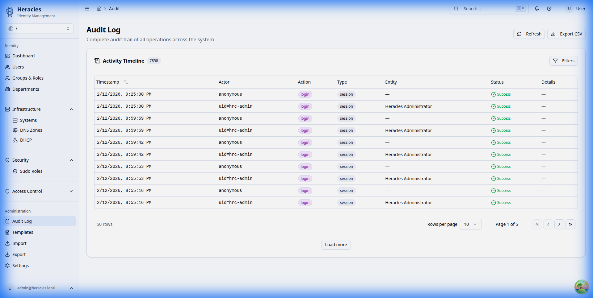
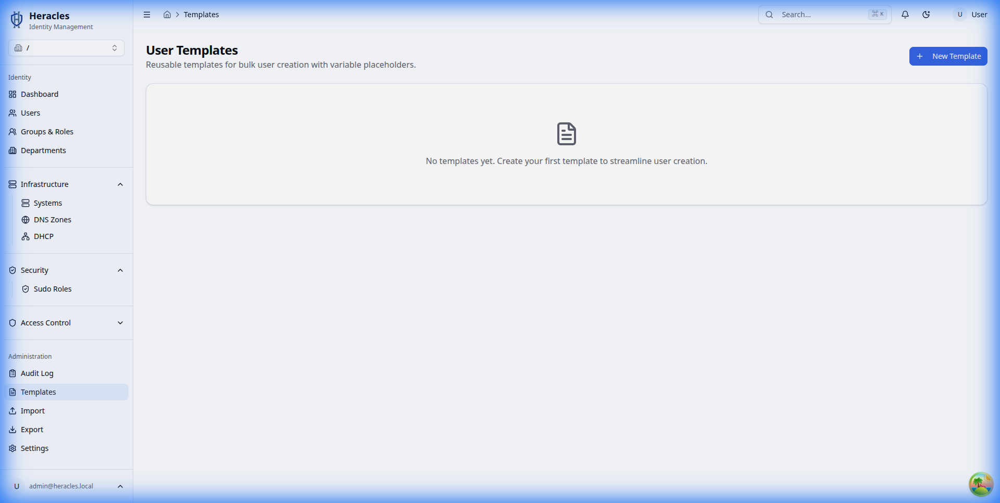

# Administration

Monitor system activity and configure global settings.

## Audit Logs

### Activity Log
View a detailed history of all actions performed within the Heracles directory, including who performed the action, what was changed, and when.

## System Settings

### Configuration
Manage global system preferences, integrations, and default behaviors.

## Templates

### User Templates
Define templates to standardize user creation with pre-defined attributes and group memberships.

