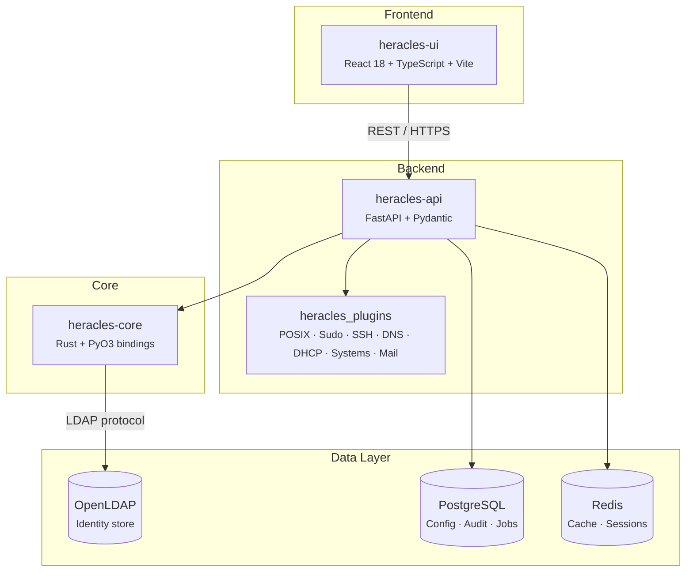

# Architecture

Heracles follows a layered, modular architecture with clear separation of concerns.

---

## System Overview

---

## Data Flow

Every user action follows the same path:

1. **UI** sends an HTTP request to the API
2. **API** validates the request (Pydantic), checks authentication (JWT), and evaluates ACL permissions
3. **Services** execute business logic and delegate LDAP operations to **heracles-core**
4. **heracles-core** (Rust) handles the LDAP protocol, password hashing, and schema validation
5. **OpenLDAP** stores and retrieves identity data
6. **PostgreSQL** persists audit logs, settings, and job queues
7. **Redis** caches frequently accessed data and manages sessions

---

## Component Summary

| Component | Language | Responsibility |
|---|---|---|
| `heracles-ui` | TypeScript / React | Web interface, forms, dashboards |
| `heracles-api` | Python / FastAPI | REST API, auth, business logic, plugin host |
| `heracles-core` | Rust | LDAP ops, password hashing, schema validation |
| `heracles_plugins` | Python | Domain extensions (POSIX, DNS, etc.) |

[:octicons-arrow-right-24: Component details](components.md) · [:octicons-arrow-right-24: Data model](data-model.md)
