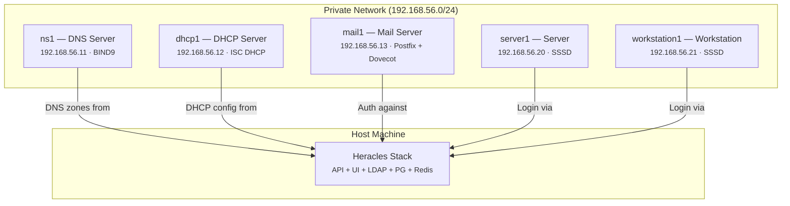

# Demo Environment

Heracles includes a full demo environment using Vagrant that provisions real virtual machines to demonstrate LDAP-integrated infrastructure services.

---

## Overview

The demo creates an isolated network of VMs that consume data from the Heracles LDAP directory. This lets you test DNS resolution, DHCP leases, SSH authentication, and sudo rules in a realistic environment.




---

## Prerequisites

- [Vagrant](https://www.vagrantup.com/) 2.3+
- [VirtualBox](https://www.virtualbox.org/) or libvirt
- Heracles stack running on the host (`make up`)

---

## Quick Start

```bash
# Prepare TLS certificates for VMs
mkdir -p demo/config/ca demo/config/certs
cp pki/dev/ca/heracles-dev-ca.crt demo/config/ca/
cp pki/dev/server/heracles.local.crt demo/config/certs/
cp pki/dev/server/heracles.local.key demo/config/certs/

# Start the demo environment
make demo
```

---

## Virtual Machines

### ns1 — DNS Server (BIND9)

- **IP:** `192.168.56.11`
- **Integration:** Reads DNS zones from Heracles LDAP
- **Test:** `dig @192.168.56.11 server1.heracles.local`

### dhcp1 — DHCP Server (ISC DHCP)

- **IP:** `192.168.56.12`
- **Integration:** Fetches subnet and pool configuration from LDAP

### mail1 — Mail Server (Postfix + Dovecot)

- **IP:** `192.168.56.13`
- **Integration:** Authenticates users against Heracles LDAP

### server1 & workstation1 — Client Machines

- **IPs:** `192.168.56.20`, `192.168.56.21`
- **Integration:** Joined to the domain via SSSD — users can SSH in with LDAP credentials

---

## Testing the Demo

### SSH Authentication

After creating a user in Heracles with POSIX and SSH attributes:

```bash
ssh -i demo/keys/testuser testuser@192.168.56.20 'whoami'
```

### Sudo Rules

Test sudo rules defined in Heracles:

```bash
ssh -i demo/keys/testuser testuser@192.168.56.20 'sudo whoami'
```

### DNS Resolution

```bash
dig @192.168.56.11 server1.heracles.local
```

---

## Cleanup

```bash
cd demo && vagrant destroy -f
```

See `demo/README.md` for complete documentation.
