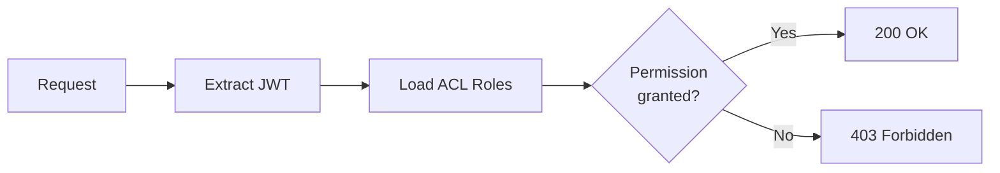

# Access Control

Heracles uses a role-based access control (ACL) system to determine what users can see and do within the directory.

---

## Concepts

### ACL Roles

An ACL role defines a set of **permissions** that can be assigned to users or groups. Permissions control access to specific **object types** and **operations**.

### Permissions

Each permission specifies:

| Component | Description | Example |
|---|---|---|
| **Object type** | What kind of entry | `user`, `group`, `system`, `dns` |
| **Operation** | What action | `read`, `write`, `create`, `delete` |
| **Scope** | Where it applies | All entries, specific OU, self only |

### Built-in Roles

| Role | Description |
|---|---|
| `admin` | Full access to all objects and operations |
| `user-manager` | Create, edit, and delete users |
| `group-manager` | Create, edit, and delete groups |
| `viewer` | Read-only access to all objects |
| `self` | Users can edit their own profile |

---

## Policy List

View and manage ACL policies from the **Access Control** section.


---

## How ACLs Are Evaluated

1. The API extracts the user's identity from the JWT token
2. The user's ACL roles are loaded (from direct assignment and group membership)
3. For each API request, the required permission is checked against the user's roles
4. If **any** role grants the required permission, access is allowed
5. If **no** role matches, the request is denied with `403 Forbidden`



---

## API Permission Format

Permissions follow the pattern `object:operation`:

```
user:read       # Read user entries
user:write      # Modify user entries
user:create     # Create new users
user:delete     # Delete users
group:read      # Read groups
dns:write       # Modify DNS zones/records
sudo:create     # Create sudo rules
system:delete   # Delete systems
```

ACL roles are stored in LDAP under `ou=aclroles` and evaluated by the API on every request.
