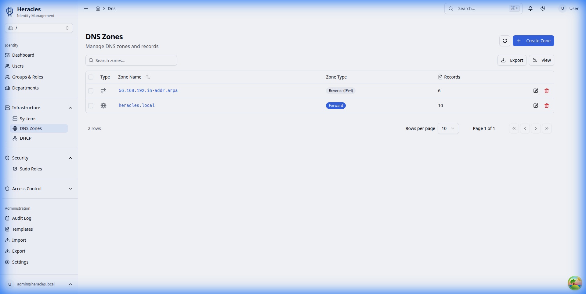
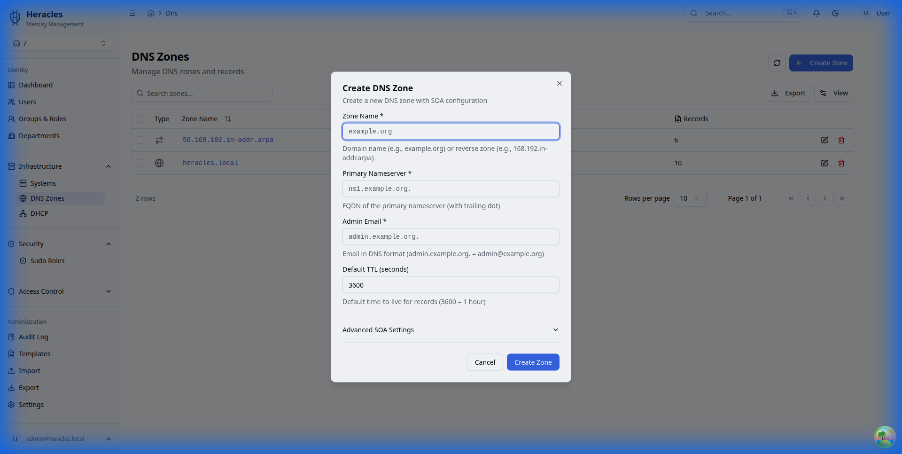

# DNS Management

Manage forward and reverse DNS zones stored in LDAP. Changes made in Heracles are synchronized to BIND9 servers through LDAP-backed zone files.

---

## Zone List

View all DNS zones — both forward lookup and reverse lookup zones.



---

## Creating a Zone

Click **Create Zone** to add a new DNS zone.



### Forward Zone

| Field | Description | Example |
|---|---|---|
| Zone name | Domain name | `example.com` |
| SOA record | Start of authority | Auto-generated |
| Primary NS | Authoritative nameserver | `ns1.example.com` |
| Admin email | Zone administrator | `admin@example.com` |
| TTL | Default time-to-live | `3600` |

### Reverse Zone

Create reverse zones for PTR records. Heracles supports automatic reverse zone creation when adding A records with the "create PTR" option.

---

## Managing Records

Within a zone, manage individual DNS records:


### Supported Record Types

| Type | Purpose | Example |
|---|---|---|
| A | IPv4 address | `192.168.1.10` |
| AAAA | IPv6 address | `2001:db8::1` |
| CNAME | Alias | `www → web.example.com` |
| MX | Mail exchanger | `10 mail.example.com` |
| NS | Nameserver | `ns1.example.com` |
| PTR | Reverse lookup | `10.1.168.192.in-addr.arpa → host.example.com` |
| SRV | Service locator | `_ldap._tcp.example.com` |
| TXT | Text record | SPF, DKIM, DMARC |

---

## LDAP Integration

DNS zones and records are stored under `ou=dns` in the LDAP tree:

```
ou=dns,dc=example,dc=com
├── zoneName=example.com
│   ├── relativeDomainName=@          # SOA, NS
│   ├── relativeDomainName=ns1        # A record
│   ├── relativeDomainName=mail       # A + MX
│   └── relativeDomainName=www        # CNAME
└── zoneName=1.168.192.in-addr.arpa
    └── relativeDomainName=10         # PTR
```

BIND9 servers configured with the `sdb-ldap` backend read zones directly from LDAP.
