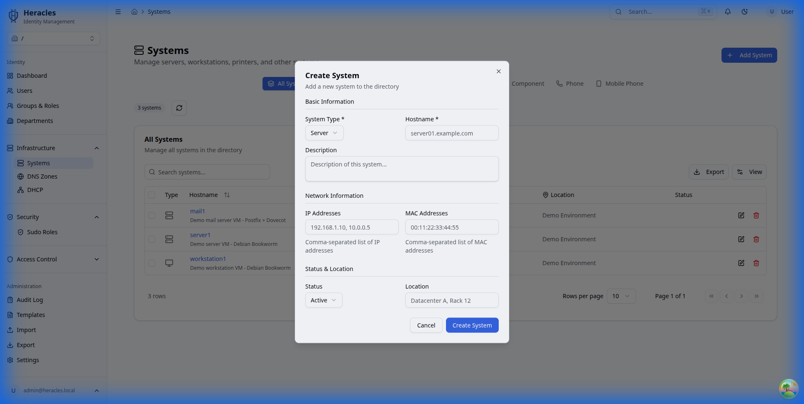

# Systems

Track and manage servers, workstations, and network devices in your directory.

---

## System List

View all registered systems with their type, IP address, and status.

---

## Adding a System

Click **Add System** to register a new machine.

| Field | Description | Example |
|---|---|---|
| Hostname (`cn`) | System name | `server1` |
| Type | System category | Server, Workstation, Printer, etc. |
| IP Address | Network address | `192.168.1.10` |
| MAC Address | Hardware address | `00:11:22:33:44:55` |
| Description | Purpose or role | `Web application server` |
| Location | Physical location | `Rack A3, DC-Paris` |

---

## System Categories

Systems are organized into sub-OUs by type:

| Category | OU | Description |
|---|---|---|
| Servers | `ou=servers,ou=systems` | Production and staging servers |
| Workstations | `ou=workstations,ou=systems` | User desktops and laptops |
| Terminals | `ou=terminals,ou=systems` | Thin clients |
| Printers | `ou=printers,ou=systems` | Network printers |
| Components | `ou=components,ou=systems` | Switches, routers, etc. |
| Phones | `ou=phones,ou=systems` | VoIP devices |
| Mobiles | `ou=mobiles,ou=systems` | Mobile devices |

---

## DNS & DHCP Integration

When you add a system with an IP address and hostname:

- A **DNS A record** can be automatically created in the appropriate zone
- A **DHCP fixed host** entry can be created if a MAC address is provided

This keeps your inventory, DNS, and DHCP in sync through a single source of truth in LDAP.
