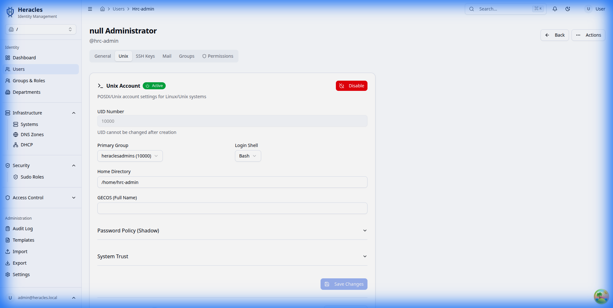
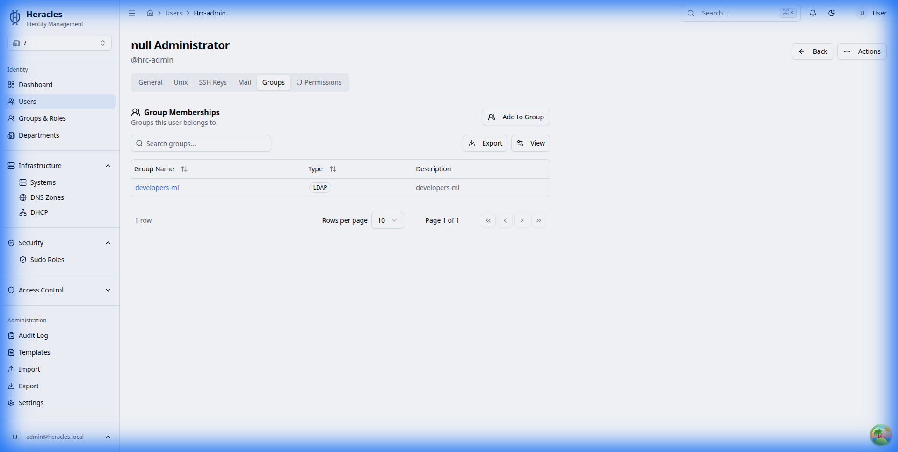

# Users

Manage user accounts in your LDAP directory.

---

## User List

The user list shows all accounts in the directory. Use the search bar to filter by name, email, UID, or any attribute.

### Filtering

Use the filter syntax to narrow results:

- **Name**: Type any part of the user's name
- **Email**: Search by email address
- **UID**: Search by username

---

## Creating a User

Click **Create User** to open the creation form.

### Required Fields

| Field | Description |
|---|---|
| Username (`uid`) | Unique login identifier |
| First Name (`givenName`) | User's first name |
| Last Name (`sn`) | User's surname |

### Optional Fields

| Field | Description |
|---|---|
| Email (`mail`) | Email address |
| Phone (`telephoneNumber`) | Phone number |
| Password | Initial password (hashed automatically) |
| Photo | JPEG profile photo |

!!! tip "Templates"
    Use [user templates](../administration/audit.md) to pre-fill fields and auto-assign groups for common roles.

---

## User Details

Click any user to view and edit their full profile. The detail view is organized into tabs:

### General

Basic profile information — name, email, phone, and photo.

### Unix (POSIX Plugin)

Manage POSIX attributes for Unix/Linux access:

- **UID Number** — Unique numeric user ID (auto-allocated if empty)
- **GID Number** — Primary group ID
- **Home Directory** — e.g., `/home/jdoe`
- **Login Shell** — e.g., `/bin/bash`

### SSH Keys (SSH Plugin)

Add and manage SSH public keys for passwordless server access. Keys are stored in LDAP using the `ldapPublicKey` object class.

### Mail (Mail Plugin)

Configure email-related attributes:

- Primary email address
- Mail aliases
- Mail routing

### Groups

View and manage group memberships. Add or remove the user from any group in the directory.

### Permissions

View the user's effective permissions — which ACL roles apply and what operations they can perform.

---

## Editing a User

Edit any field directly in the detail view and click **Save**. Changes are written to LDAP immediately.

!!! info "Audit Trail"
    All modifications are recorded in the [audit log](../administration/audit.md) with the acting user, timestamp, and changed attributes.

---

## Deleting a User

Click **Delete** in the user detail view. This removes the LDAP entry and all associated data (group memberships, sudo rules referencing this user, etc.).

!!! danger "Irreversible"
    User deletion cannot be undone. The LDAP entry is permanently removed.
