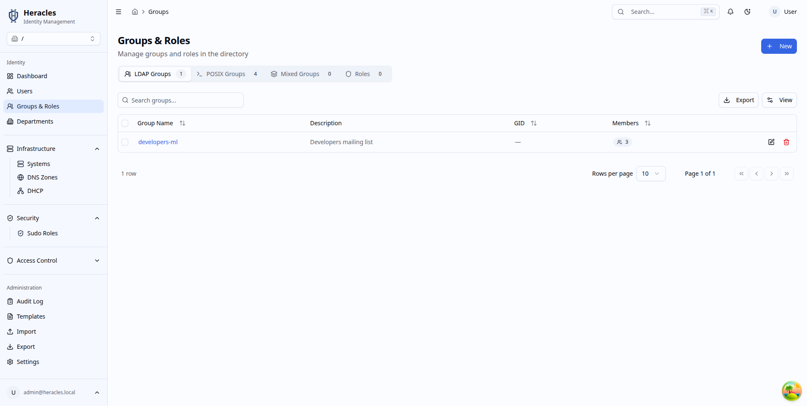
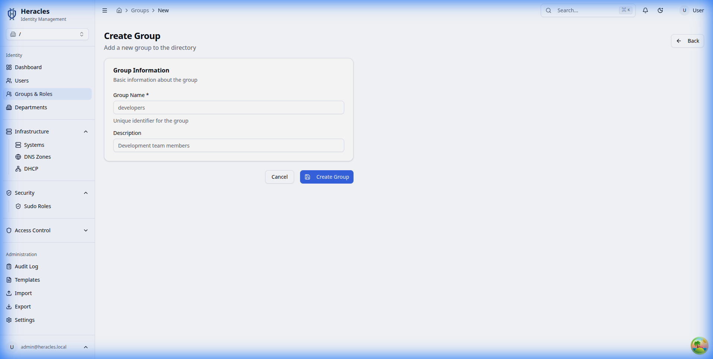
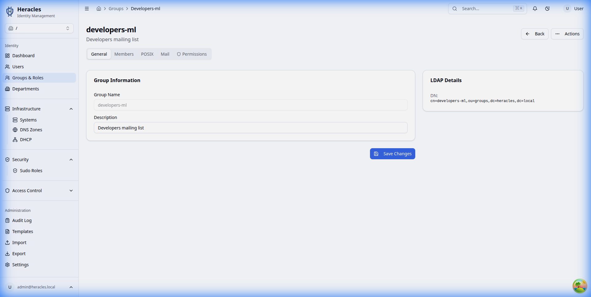
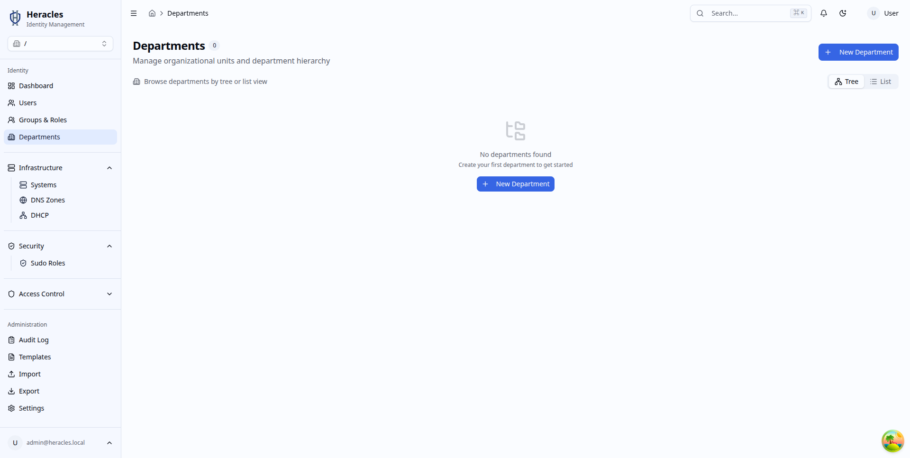
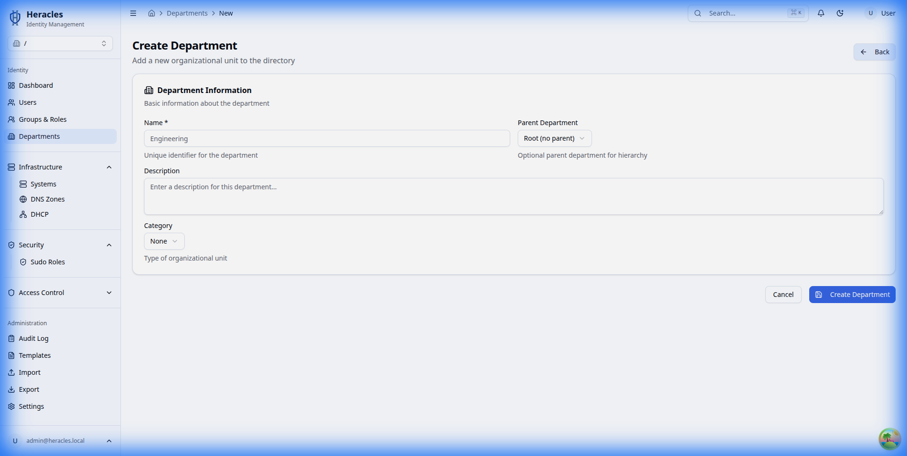

# Identity Management

Manage the core entities of your directory: Users, Groups, and Departments (Organizational Units).

## Users

### User List
View and search all users in the directory. You can filter by name, email, or other attributes.

### create User
To add a new user, click the "Create User" button. Fill in the required basic information such as Username, First Name, and Last Name.

### User Details
Click on a user to view their full profile and manage specific settings.

- **General**: Basic profile information.
  
- **Unix**: Manage POSIX attributes like UID, GID, and Login Shell.
  
- **SSH Keys**: Manage public SSH keys for server access.
  
- **Mail**: Configure email attributes.
  
- **Groups**: Manage group memberships.
  
- **Permissions**: View assigned ACLs and effective permissions.
  

## Groups

### Group List
View all groups in the directory.

### Create Group
Create new groups for organizing users and managing permissions.

### Group Details
View group members and attributes.

## Departments

### Department List
Manage the organizational hierarchy with Departments (OUs).

### Create Department
Add new departments to structure your directory.

