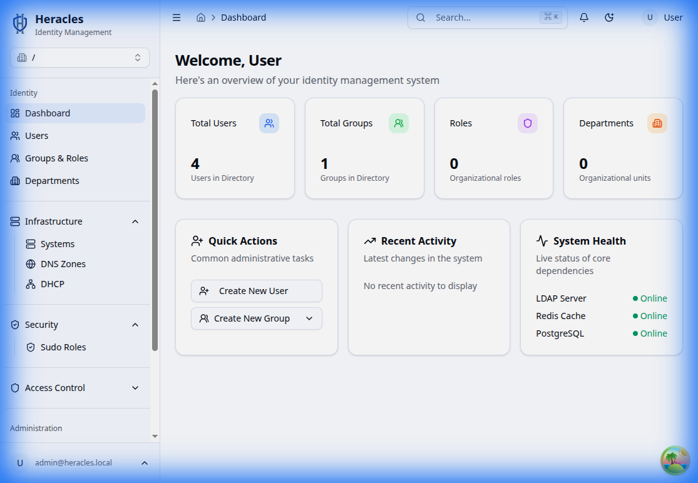

# Welcome to Heracles

Heracles is a comprehensive Identity Management System designed to simplify directory services, infrastructure management, and security access controls.

## Dashboard overview

The dashboard provides a real-time view of your organization's directory status. At a glance, you can see total counts for users, groups, and systems, as well as recent activity and system health indicators.

