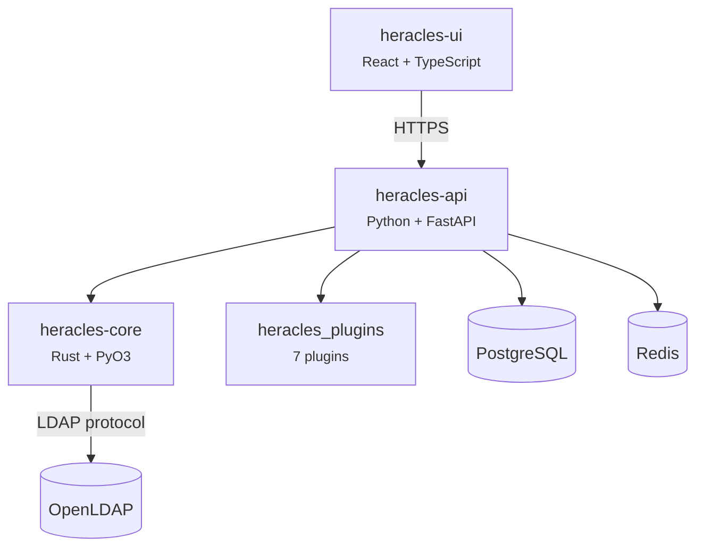

---
hide:
  - navigation
---

# Heracles

**A modern LDAP identity management platform** — built with Rust, FastAPI, and React.

Heracles gives you a fast, extensible web interface over your LDAP directory while keeping **100% compatibility** with standard LDAP schemas and tooling.

-   :material-rocket-launch:{ .lg .middle } **Get Started in 30 seconds**

    ---

    Install with Docker Compose and have a running instance immediately.

    [:octicons-arrow-right-24: Quick Start](getting-started/quickstart.md)

-   :material-account-group:{ .lg .middle } **Manage Identities**

    ---

    Users, groups, departments — full lifecycle management with POSIX, SSH, mail, and more.

    [:octicons-arrow-right-24: User Guide](guide/index.md)

-   :material-api:{ .lg .middle } **API-First Design**

    ---

    Every feature is exposed through a versioned REST API with OpenAPI documentation.

    [:octicons-arrow-right-24: API Reference](api/index.md)

-   :material-puzzle:{ .lg .middle } **Plugin Architecture**

    ---

    7 built-in plugins (POSIX, Sudo, SSH, DNS, DHCP, Systems, Mail) — or build your own.

    [:octicons-arrow-right-24: Plugins](plugins/index.md)

---

## Why Heracles?

| Capability | Description |
|---|---|
| **High Performance** | Rust-powered LDAP operations and password hashing via PyO3 bindings |
| **Standard LDAP** | Works with OpenLDAP and 389DS — no proprietary schemas required |
| **Modern Stack** | React 18+ / TypeScript UI, FastAPI backend, PostgreSQL + Redis |
| **Enterprise Security** | JWT auth, fine-grained ACLs, audit logging, TLS everywhere |
| **Extensible** | Plugin system for adding tabs, object types, and API endpoints |

---

## Architecture at a Glance

[:octicons-arrow-right-24: Full Architecture](architecture/index.md)

---

## Dashboard

The dashboard provides a real-time view of your directory: user/group/system counts, recent activity, and health indicators.

---

## Tech Stack

| Layer | Technology | Version |
|---|---|---|
| Core library | Rust | 1.75+ |
| API backend | Python + FastAPI | 3.11+ |
| Frontend | React + TypeScript | 18+ / 5+ |
| Database | PostgreSQL | 15+ |
| Cache | Redis | 7+ |
| Directory | OpenLDAP / 389DS | — |

---

## License

Heracles is open-source software licensed under [GPL-2.0](https://github.com/abdoufermat5/heracles/blob/main/LICENSE).
