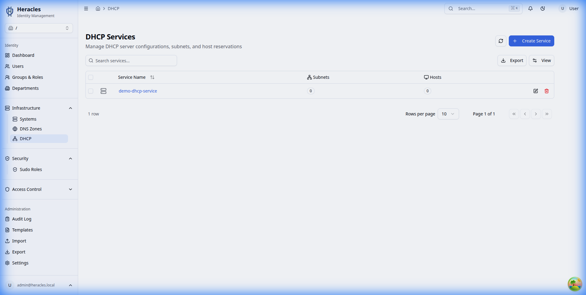
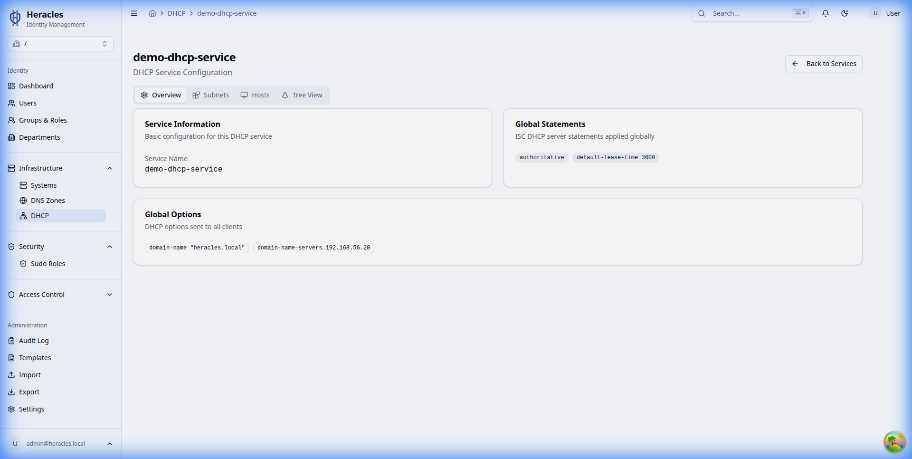

# Infrastructure Management

Manage your network infrastructure services directly from Heracles.

## DNS Zones

### Zone List
View and manage all DNS zones (Forward and Reverse).

### Create Zone
Create new DNS zones with ease. Supports automatic reverse zone creation.

### Zone Records
Manage DNS records within a zone.

## DHCP Services

### Service List
Manage DHCP server instances.

### Create Service
Deploy new DHCP services to your network.

### Service Details
Configure subnets, pools, and options for a specific DHCP service.

## Systems Inventory

### System List
Track all systems (servers, workstations, appliances) in your environment.

### Add System
Register new systems to the directory.

