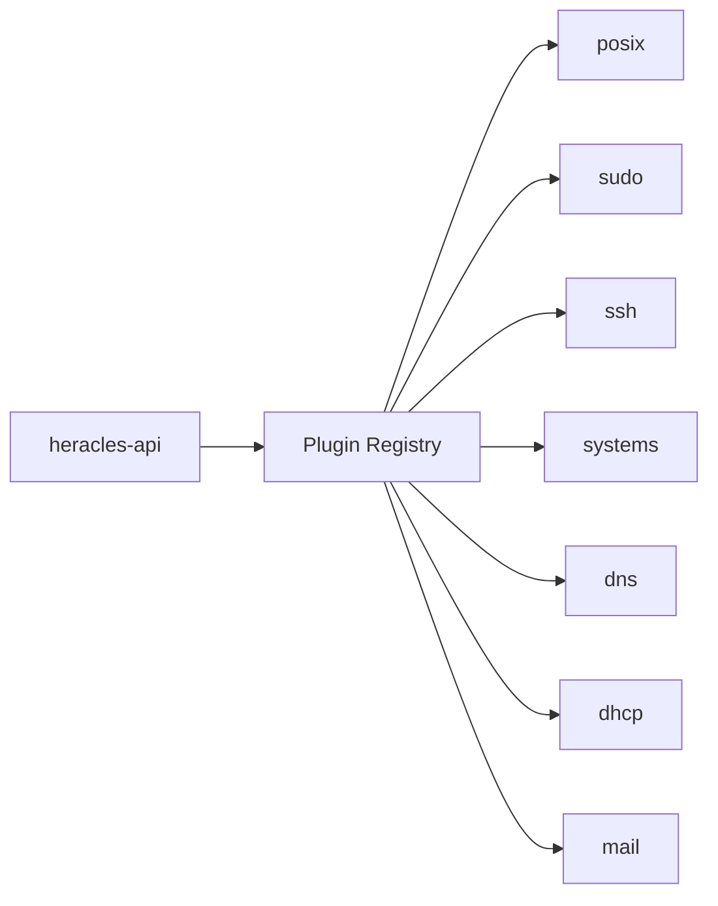

# Plugins

Heracles uses a plugin architecture to extend functionality without modifying the core system.

---

## How Plugins Work

Plugins are Python packages that register with the API at startup. Each plugin can:

- **Add tabs** to existing objects (e.g., "Unix" tab on users)
- **Add new object types** (e.g., sudo rules, DNS zones)
- **Register API endpoints** (mounted under `/api/v1/<plugin>/`)
- **Extend LDAP schemas** (using standard schemas only)

---

## Plugin Types

| Type | Description | Example |
|---|---|---|
| **Tab Plugin** | Adds a tab to an existing object (user/group) | `ssh`, `mail` |
| **Management Plugin** | Introduces a new object type with its own list/detail pages | `sudo`, `systems`, `dns`, `dhcp` |
| **Hybrid Plugin** | Both tab and management capabilities | `posix` (user tab + group management) |

---

## Quick Links

- [Available Plugins](available.md) — Details on the 7 built-in plugins
- [Plugin Development](development.md) — How to build your own plugin
