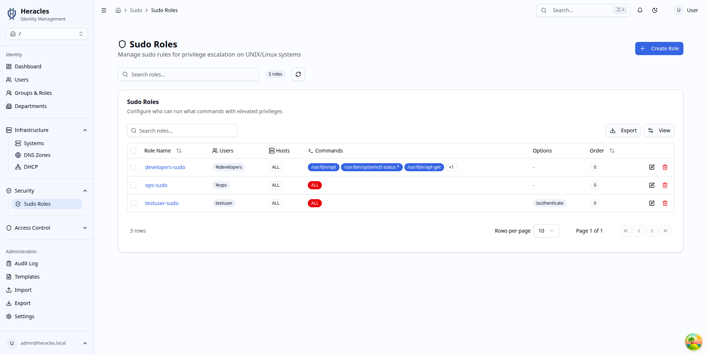
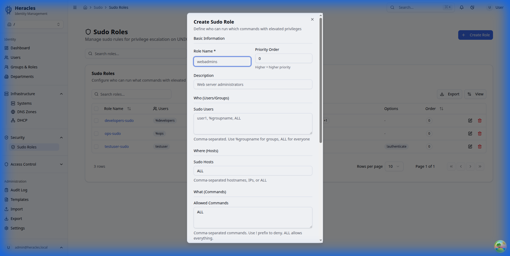
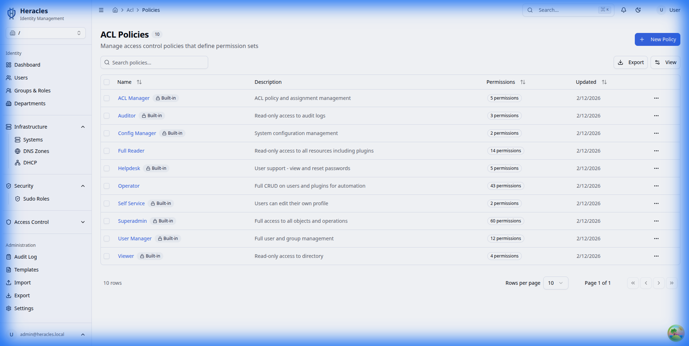

# Security & Access Control

Control access to infrastructure and directory resources.

## Sudo Roles

### Role List
Manage sudo roles to define privilege escalation rules for users on Unix/Linux systems.

### Create Role
Define new sudo roles with specific commands, hosts, and user assignments.

## Access Control Lists (ACLs)

### Policies
View and manage ACL policies that determine what users can see and do within the Heracles directory.

