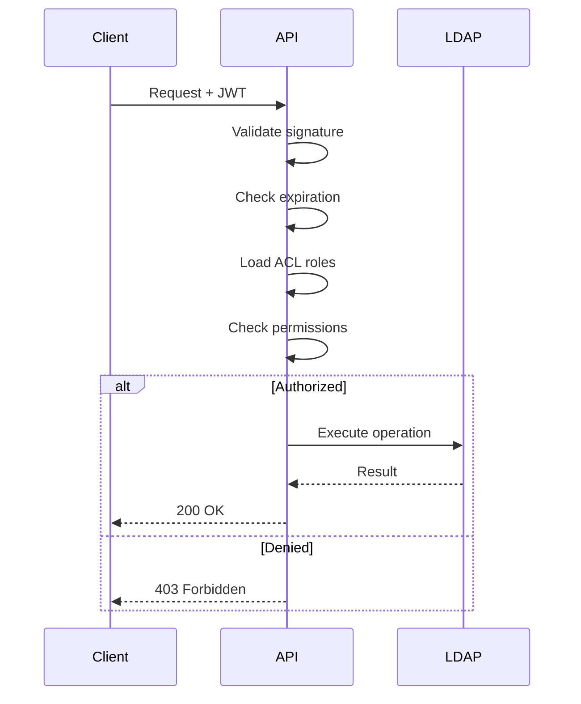

# Authentication & Tokens

How Heracles handles authentication, JWT tokens, and sessions.

---

## Authentication Methods

| Method | Use Case | Status |
|---|---|---|
| Form Login | Web UI | Available |
| JWT Bearer | API clients | Available |
| API Keys | Integrations | Planned (v1.1) |
| OIDC / SSO | Enterprise federation | Planned (v2.0) |

---

## JWT Token Structure

### Access Token

```json
{
  "header": {
    "alg": "HS256",
    "typ": "JWT"
  },
  "payload": {
    "sub": "uid=jdoe,ou=people,dc=example,dc=com",
    "uid": "jdoe",
    "iat": 1737100000,
    "exp": 1737101800,
    "jti": "550e8400-e29b-41d4-a716-446655440000",
    "type": "access"
  }
}
```

### Token Lifetimes

| Token | Duration | Renewal Method |
|---|---|---|
| Access token | 30 minutes | Refresh token |
| Refresh token | 7 days | Re-login required |

---

## Token Storage

!!! danger "Security Rule"
    Tokens must **never** be stored in `localStorage` — it is vulnerable to XSS attacks.

=== "Correct — httpOnly Cookie"

    ```
    Set-Cookie: access_token=xxx; HttpOnly; Secure; SameSite=Strict
    ```

    The backend sets the cookie. The frontend never touches the token directly.

=== "Incorrect — localStorage"

    ```javascript
    // ❌ NEVER do this
    localStorage.setItem('token', jwt);
    ```

---

## Token Validation Flow

Every API request goes through this validation:



---

## Session Revocation

Tokens can be invalidated before expiration through:

1. **Logout endpoint** — `POST /auth/logout` blacklists the token
2. **Password change** — All tokens for the user are invalidated
3. **Admin action** — Administrators can revoke sessions for any user

---

## Password Hashing

Heracles supports multiple hashing algorithms for LDAP passwords:

| Method | Security | Performance | Recommended |
|---|---|---|---|
| Argon2 | :white_check_mark: Excellent | Slower | :white_check_mark: Default |
| bcrypt | :white_check_mark: Strong | Moderate | Good alternative |
| SSHA | Adequate | Fast | Legacy compatibility |
| SHA | Weak | Fast | Legacy only |
| MD5 / SMD5 | :x: Weak | Fast | Not recommended |

Password hashing is handled by the Rust core (`heracles-core`) for maximum performance and memory safety.
