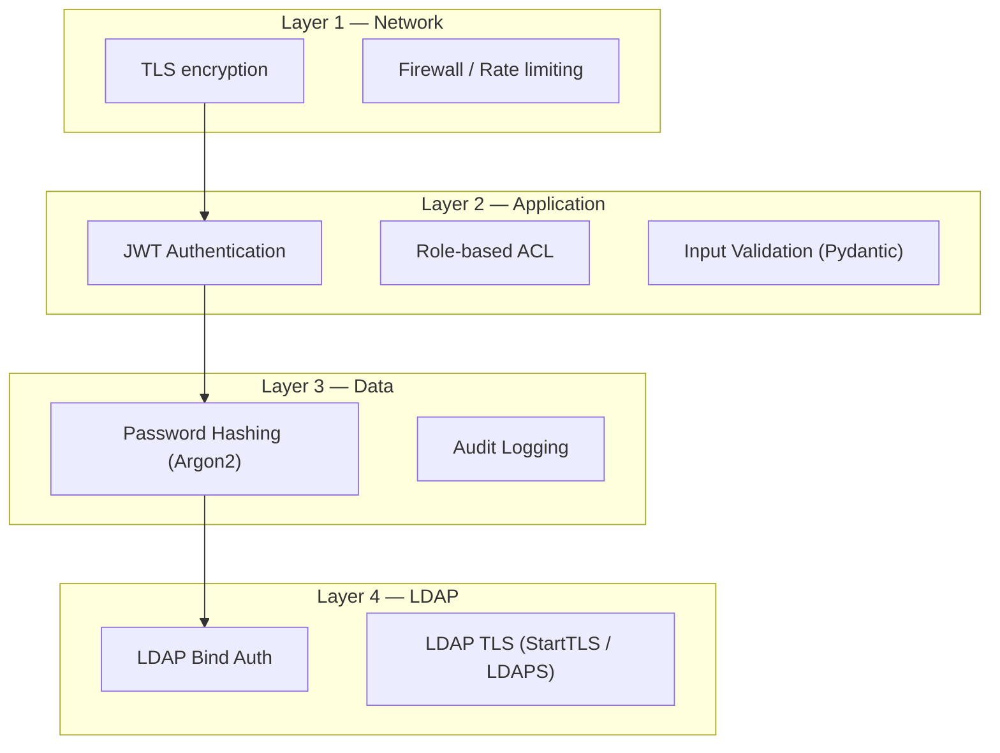

# Security

Heracles implements defense-in-depth security across all layers of the stack.

---

## Security Layers

---

## Core Principles

| Principle | Implementation |
|---|---|
| **Defense in Depth** | Four security layers — network, application, data, LDAP |
| **Least Privilege** | Users only get the permissions they need |
| **Zero Trust** | Every request is authenticated and authorized |
| **No Secrets in Code** | All credentials via environment variables |
| **Input Validation** | Pydantic models on every API request |
| **LDAP Injection Prevention** | All user input escaped with `escape_filter_chars()` |

---

## Quick Links

- [Authentication & Tokens](auth-tokens.md) — JWT lifecycle, token storage, session management
- [LDAP Security](ldap.md) — TLS configuration, bind security, input escaping
- [Access Control](../guide/acl.md) — Role-based permissions
